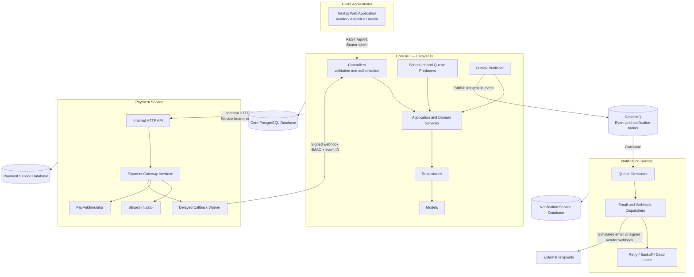
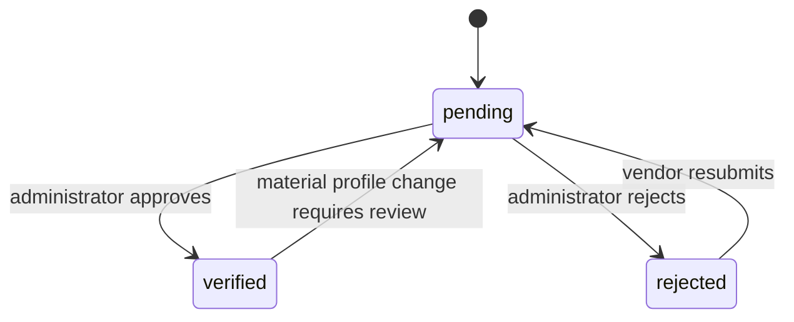
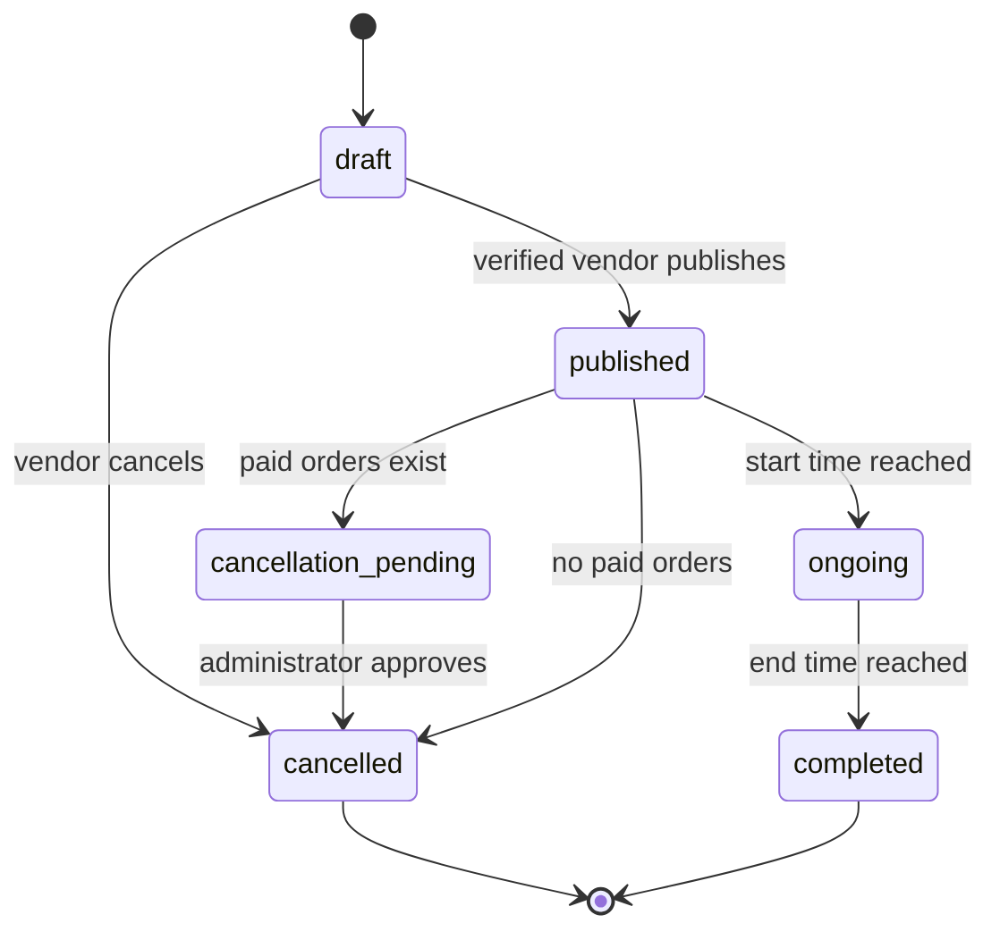
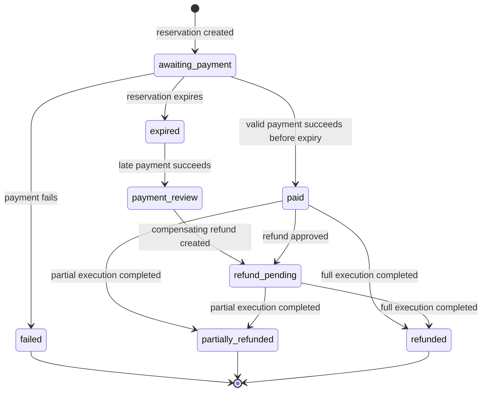
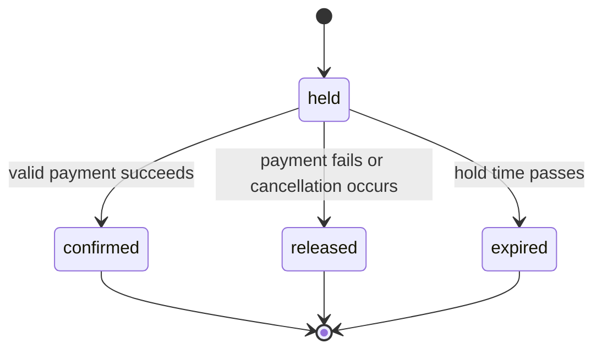
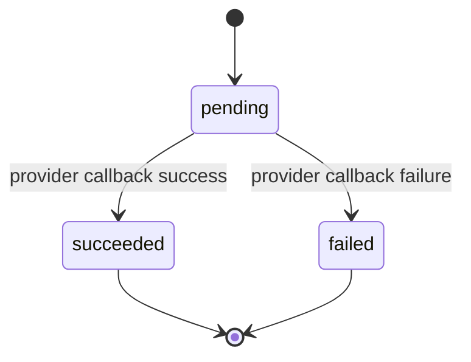
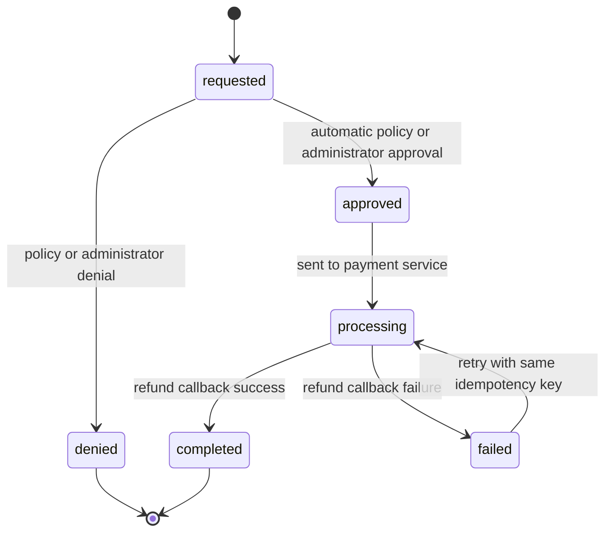
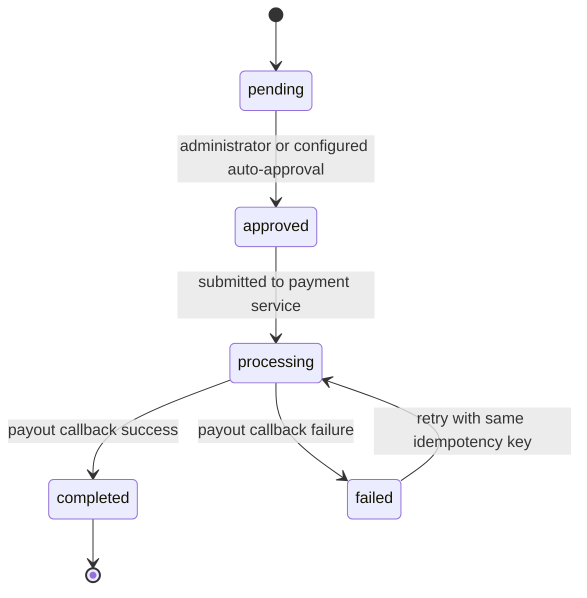
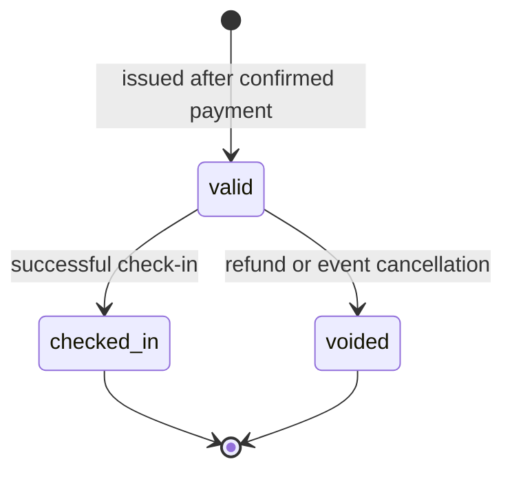

# EventHub — Product, Architecture, and API Specification

## 1. Product Requirements

### 1.1 Product Scope

EventHub is a multi-vendor event ticketing and payout platform used by:

- **Vendors** to complete onboarding, create events, configure tickets, monitor sales, and receive payouts.
- **Attendees** to discover events, reserve tickets, complete payment, manage orders, request refunds, and check in.
- **Platform administrators** to approve vendors, configure commission rates, review refunds and disputes, and monitor platform activity.

The core system must protect ticket inventory from overselling and ensure that every operation involving money is auditable, idempotent, and recoverable after partial failure.

### 1.2 Specification Clarification

The source brief uses both **NEXT Ventures** and **FundedNext** as company references. The system and repository use **EventHub** consistently as the product name.

### 1.3 User Stories

#### Vendor

- As a vendor, I can register and submit business and KYC information.
- As a vendor, I can view whether my KYC status is pending, verified, or rejected.
- As a verified vendor, I can create, edit, publish, cancel, and view my events.
- As a vendor, I can configure event start and end times together with an IANA timezone.
- As a vendor, I can define early-bird, VIP, general-admission, and group-bundle ticket types.
- As a vendor, I can configure price, availability window, and inventory consumption for each ticket type.
- As a vendor, I can view ticket sales and revenue for each event.
- As a vendor, I can view payout history and payout status.
- As a vendor, I can register webhook endpoints for supported platform events.
- As a vendor, I cannot access or modify another vendor's events, orders, reports, webhooks, or payouts.

#### Attendee

- As an attendee, I can browse and search published events.
- As an attendee, I can view event details and currently available ticket types.
- As an attendee, I can reserve ticket quantities for 15 minutes while completing payment.
- As an attendee, I can choose a simulated payment gateway and complete checkout.
- As an attendee, I can view my order history and issued tickets.
- As an attendee, I can request a whole-order refund subject to the event-time refund policy.
- As an attendee, I can view the status of my refund request.
- As an attendee, I can join a ticket-type waitlist when inventory is unavailable.
- As an attendee, I can check in with a ticket QR code.
- As an attendee, I cannot access another attendee's orders, tickets, payments, or refund requests.

#### Platform Administrator

- As an administrator, I can approve or reject vendor KYC submissions.
- As an administrator, I can configure a versioned platform commission rate and minimum payout threshold.
- As an administrator, I can view total sales, active events, vendor count, and payout status.
- As an administrator, I can review refund requests and disputes.
- As an administrator, I can approve or deny refund requests that require manual review.
- As an administrator, I can approve vendor payouts.
- As an administrator, I can inspect audit history for orders, payments, refunds, and payouts.

### 1.4 Assumptions and Constraints

| # | Decision | Rationale |
|---|---|---|
| 1 | The initial implementation supports one configured currency, defaulting to `MYR`. | Multi-currency settlement, FX conversion, and exchange-rate history are outside the current scope. Currency is still stored on every financial aggregate. |
| 2 | Monetary amounts are stored as integer minor units, such as sen, and never as floating-point values. | Prevents binary floating-point errors and makes rounding explicit. |
| 3 | One order contains tickets for exactly one event. | Keeps reservation expiry, event-time refund policy, cancellation, and payout attribution deterministic. |
| 4 | Refund requests apply to the whole order. | Item-level and ticket-level refunds add allocation and settlement complexity and are deferred. |
| 5 | Payment gateways are simulated behind a provider interface. | No real payment-provider integration is required, while provider boundaries and idempotency remain realistic. |
| 6 | Vendor KYC is represented by a status and supporting profile data. | External identity-verification integration is not part of the current implementation. |
| 7 | Ticket reservations expire after 15 minutes. | Matches the reservation requirement and provides one authoritative hold duration. |
| 8 | Refund eligibility is calculated against the event start time. | The policy is based on hours remaining before the event. |
| 9 | All timestamps are stored in UTC. Events also store an IANA timezone for local input and display. | Avoids ambiguous calculations while preserving the event's local-time context. |
| 10 | Group bundles are ticket products backed by a shared inventory pool. | A group-of-four product can consume four admission units from the same pool used by general admission. |
| 11 | The platform commission is global and versioned by effective date. | No per-vendor commission override is specified. Payouts retain a rate snapshot. |
| 12 | A vendor may cancel a draft event directly. Cancelling a published event with paid orders requires administrator approval or an explicit cancellation workflow. | Prevents vendors from bypassing attendee refund and notification handling. |
| 13 | A successful payment received after reservation expiry does not issue tickets. | Inventory may already have been released and sold. The order enters payment review and a compensating refund is initiated. |
| 14 | The minimum payout threshold is globally configured and versioned. | Payout decisions remain reproducible after configuration changes. |
| 15 | Ticket transfer, real QR scanning, real KYC, real payment providers, and advanced analytics are deferred. | These features do not change the core inventory and financial architecture. |

### 1.5 Scope Priority

#### Required for the initial implementation

- Authentication and role-based authorization.
- Vendor onboarding and KYC status management.
- Vendor-owned event and ticket-type management.
- Event publishing and lifecycle validation.
- Shared inventory pools and group-bundle inventory consumption.
- Ticket reservation with 15-minute expiry.
- Database row locking and oversell prevention.
- Payment creation through two simulated gateways.
- Idempotent payment requests and webhook processing.
- Whole-order refund policy calculation.
- Refund request, approval, execution, and callback flow.
- Versioned commission calculation.
- Payout preview, approval, execution, and callback flow.
- Queue-driven notification delivery with retry and dead-letter handling.
- Reservation cleanup, event reminders, payout batching, sales reports, and waitlist processing.
- Minimal vendor, attendee, and administrator interfaces.
- Seed data and documented demo accounts.
- OpenAPI or Postman API documentation.
- Unit and integration tests for inventory, order, refund, and payout rules.
- Docker Compose or equivalent reproducible local setup.
- Project instructions, service-specific agent guidance, and technical decision records.

#### Implemented with limited breadth

- Platform analytics use pre-aggregated daily sales records and a small set of metrics.
- Disputes support a basic open and resolved lifecycle.
- QR check-in validates and consumes an issued ticket; camera scanning is not required.
- Waitlist processing covers first-in-first-out notification after inventory release but does not guarantee inventory allocation.
- Notification channels are simulated email logging and HTTP vendor webhooks.

#### Deferred

- Ticket transfers.
- Seat maps and assigned seating.
- Multi-currency pricing and settlement.
- Per-vendor commission contracts.
- Real payment providers.
- Real KYC integration.
- Automated tax calculation.
- Complex promotion and coupon engines.
- Item-level refunds.
- Advanced fraud detection.
- Full business-intelligence reporting.
- Pixel-perfect frontend design.

### 1.6 Domain Invariants

The implementation must preserve the following invariants:

1. `reserved_units + sold_units` must never exceed an inventory pool's capacity.
2. Only published events with an active sales window may accept new reservations.
3. Only verified vendors may publish events.
4. The ticket type, inventory pool, and order must belong to the same event.
5. Order prices, ticket admission units, commission rates, and refund percentages are snapshotted and are not recalculated from mutable configuration.
6. A payment idempotency key may create at most one payment aggregate.
7. A provider webhook event ID may be applied at most once.
8. A payout period may create at most one payout per vendor.
9. An order may issue tickets only while its reservation is held or confirmed.
10. A successful late payment must not recreate or overdraw released inventory.
11. Financial amounts are immutable after creation. Statuses may change only through validated transitions and every transition is audited.
12. Service retries reuse the same idempotency key.
13. Notification failure must not roll back a completed financial operation.
14. A refund or payout marked completed may not be executed again.

### 1.7 Risks and Edge Cases

| Risk or edge case | Expected handling |
|---|---|
| Concurrent attempts to reserve the last admission units | Lock the relevant inventory-pool rows with `SELECT ... FOR UPDATE` in a database transaction, re-read counters, validate availability, then increment reserved units. |
| An order contains ticket types backed by multiple inventory pools | Lock pool rows in deterministic ID order to avoid deadlocks. |
| Duplicate payment request | Return the original result for the existing idempotency key. Do not create a second provider operation. |
| Duplicate or out-of-order payment webhook | Deduplicate by provider event ID and validate the expected aggregate state before applying a transition. |
| Payment succeeds after the reservation expired | Record the payment as succeeded, move the order to `payment_review`, issue no tickets, and create a compensating refund request. |
| Reservation cleanup races with a payment webhook | Both flows lock the order and reservation rows. Only one valid state transition succeeds. |
| Payment service is unavailable during checkout | Keep the order in `awaiting_payment`, preserve the reservation until expiry, and retry payment creation with the same idempotency key when explicitly requested or through a controlled retry. |
| Payout batch stops after processing some vendors | Create one unique payout per vendor and period. Each payout is processed independently and retries reuse the payout idempotency key. |
| Refund request near the 24-hour or 48-hour boundary | Calculate using UTC and persist the policy result and calculation timestamp when the request is created. |
| Event cancellation after paid sales | Stop sales, release active holds, create refund requests for paid orders, and queue attendee notifications. |
| Commission rate changes after ticket sales | Resolve the effective rate during payout calculation and snapshot the rate and amount on the payout. |
| Group bundle inventory | A ticket type stores `admission_units_per_purchase`; quantity multiplied by this value is reserved from its inventory pool. |
| Notification service is offline | Outbox events remain unpublished or queue jobs remain pending. Financial operations stay committed. |
| Vendor webhook repeatedly fails | Retry with exponential backoff, mark dead-letter after the maximum attempt count, and retain the delivery history. |
| Scheduler runs twice | Jobs use unique business keys and state checks, not scheduler timing alone, to prevent duplicate effects. |
| Money rounding | Percentage calculations use integer minor units and an explicitly documented half-up rounding rule. |
| Deleted event or user has historical financial records | Use soft deletion and retain all financial references. |

### 1.8 Primary End-to-End Flows

1. A vendor completes onboarding, receives approval, creates an event, configures ticket products, and publishes it.
2. An attendee reserves tickets, initiates payment, receives a successful payment callback, and receives issued tickets.
3. An attendee requests a refund, the policy is calculated, approval occurs when required, and the payment service reports execution.
4. A scheduled payout batch calculates vendor settlement, an administrator approves it, and the payment service reports completion.
5. An event is cancelled after sales, triggering reservation release, refund preparation, and attendee notifications.

---

## 2. System Architecture

### 2.1 Technology Profile

| Component | Technology |
|---|---|
| Core API | Laravel 11, PHP 8.2+ |
| Frontend | Next.js 14, TypeScript, component library |
| Payment service | Node.js 20, TypeScript, Fastify |
| Notification service | Node.js 20, TypeScript |
| Core database | PostgreSQL 16 |
| Service databases | PostgreSQL 16 using separate databases or schemas |
| Message broker | RabbitMQ |
| Local orchestration | Docker Compose |
| API specification | OpenAPI 3.1 or Postman collection |

### 2.2 High-Level Architecture



### 2.3 Service Responsibilities

| Service | Owns | Does not own |
|---|---|---|
| Core API | Users and roles, vendors, KYC state, events, ticket products, inventory pools, orders, reservations, tickets, business payment records, refund policy and approval, payout calculation and approval, disputes, platform reporting, audit history, integration outbox | Payment-provider execution, provider retry simulation, notification delivery |
| Payment service | Gateway abstraction, simulated gateway behavior, execution idempotency, provider references, payment/refund/payout attempts, delayed callback generation | Ticket inventory, order authorization, refund eligibility, commission calculation, vendor approval |
| Notification service | Queue consumption, templates, simulated email delivery, vendor webhook delivery, exponential retry, dead-letter state, delivery history | Deciding the business event or recipient eligibility |
| Frontend | Role-specific user flows, client-side state, API integration, loading and error presentation | Authoritative authorization or business calculations |

### 2.4 Data Ownership

- The Core API uses its own PostgreSQL database and is the source of truth for business aggregates.
- The Payment service uses a separate database for idempotency records and provider-execution attempts.
- The Notification service uses a separate database for delivery attempts and dead-letter history.
- Services do not directly query another service's database.
- The same PostgreSQL server may host multiple databases or schemas in local development, but ownership remains separated.
- Cross-service consistency is achieved through API contracts, idempotency keys, signed callbacks, and reconciliation rather than distributed database transactions.

### 2.5 Communication Matrix

| From | To | Protocol | Authentication | Interaction |
|---|---|---|---|---|
| Frontend | Core API | REST under `/api/v1` | User bearer token | Synchronous |
| Core API | Payment service | Internal REST | Service bearer token and idempotency key | Synchronous request |
| Payment service | Core API | Webhook | HMAC signature, timestamp, unique event ID | Asynchronous callback |
| Core API | RabbitMQ | Outbox publisher | Private network and broker credentials | Asynchronous publish |
| RabbitMQ | Notification service | Queue consumption | Private network and broker credentials | Asynchronous consume |
| Notification service | Vendor endpoint | HTTP webhook | HMAC signature using vendor webhook secret | Asynchronous delivery |

### 2.6 Layering in the Core API

```text
HTTP Request
    -> Form Request / Input DTO
    -> Controller
    -> Application Service
    -> Domain Service
    -> Repository
    -> Model / Database

Cross-cutting concerns:
    Authorization Policies
    Transactions and Locks
    Structured Logging
    Audit Recording
    Outbox Events
    Exception Mapping
```

Controllers must not contain pricing, inventory, refund, payout, or state-transition logic.

### 2.7 Authentication and Authorization

#### User-facing API

- Laravel Sanctum personal access tokens are used for the initial implementation.
- Roles are `admin`, `vendor`, and `attendee`.
- Route middleware performs coarse role checks.
- Policies perform resource ownership checks.
- Vendor resources are always filtered and authorized by `vendor_id`.
- Attendee resources are always filtered and authorized by `user_id`.
- Administrator-only routes require the `admin` role.
- Inputs use explicit validation DTOs or Form Requests.
- Models use guarded or explicitly fillable attributes to avoid mass-assignment vulnerabilities.

#### Service-to-service API

- Core-to-payment requests use a service bearer token stored in environment configuration.
- Payment callbacks use:
  - `X-Webhook-Id`: unique provider event ID.
  - `X-Webhook-Timestamp`: Unix timestamp.
  - `X-Webhook-Signature`: HMAC-SHA256 of `timestamp + "." + raw_body`.
- The Core API rejects callbacks outside the allowed replay window.
- The Core API stores each webhook event ID under a unique constraint before applying effects.
- Vendor webhooks use the same timestamped HMAC pattern with the vendor-specific secret.

### 2.8 Transactional Boundaries

- Inventory reservation, order creation, order items, reservation rows, counter updates, audit records, and outbox records are committed in one Core database transaction.
- Payment-service HTTP calls occur after the reservation transaction commits.
- Payment, refund, and payout callbacks each use a Core database transaction and lock the affected aggregate.
- Notifications are created as outbox events in the same transaction as the business change.
- Outbox publication to RabbitMQ occurs asynchronously and may be retried without changing the business aggregate.
- No database transaction spans multiple services.

### 2.9 Partial-Failure Behavior

| Failure | Behavior |
|---|---|
| Payment service timeout during payment creation | The reservation remains valid until expiry. The payment request may be retried using the same idempotency key. |
| Core API unavailable when payment callback is sent | Payment service retries the same signed callback event. |
| Duplicate callback | Unique webhook event ID and aggregate-state validation make processing a no-op after the first successful application. |
| RabbitMQ unavailable | Outbox records remain unpublished and are retried later. |
| Notification worker unavailable | Queue items remain pending. Order, refund, or payout completion is not reversed. |
| Vendor webhook unavailable | Exponential retry is performed; delivery is dead-lettered after the maximum attempts. |
| Payout execution times out | Payout remains `processing` until callback or reconciliation. Retrying uses the same idempotency key. |
| Scheduler process restarts | Business-key uniqueness and status checks prevent duplicate financial effects. |
| Core transaction rolls back | No corresponding outbox event is committed. |
| Outbox publish succeeds but status update fails | Re-publication is safe because consumers deduplicate by integration event ID. |

---

## 3. Domain State Models

### 3.1 Vendor KYC



### 3.2 Event Lifecycle



### 3.3 Order Lifecycle



### 3.4 Reservation Lifecycle



### 3.5 Payment Lifecycle



A payment record represents the original charge. Refund state is modeled separately.

### 3.6 Refund Request Lifecycle



The refund percentage and approved amount are attributes, not statuses.

### 3.7 Payout Lifecycle



### 3.8 Ticket Lifecycle



---

## 4. Database Design

### 4.1 Core Database ERD

```mermaid
erDiagram
    USERS ||--o| VENDORS : "has vendor profile"
    USERS ||--o{ ORDERS : "places"
    USERS ||--o{ REFUND_REQUESTS : "requests"
    USERS ||--o{ WAITLIST_ENTRIES : "joins"
    USERS ||--o{ AUDIT_LOGS : "acts in"

    VENDORS ||--o{ VENDOR_BANK_ACCOUNTS : "has"
    VENDORS ||--o{ EVENTS : "creates"
    VENDORS ||--o{ PAYOUTS : "receives"
    VENDORS ||--o{ VENDOR_WEBHOOKS : "registers"
    VENDORS ||--o{ DAILY_SALES_REPORTS : "has"

    EVENTS ||--o{ TICKET_INVENTORY_POOLS : "owns"
    EVENTS ||--o{ TICKET_TYPES : "offers"
    EVENTS ||--o{ ORDERS : "receives"
    EVENTS ||--o{ DISPUTES : "relates to"
    EVENTS ||--o{ WAITLIST_ENTRIES : "has waitlist"

    TICKET_INVENTORY_POOLS ||--o{ TICKET_TYPES : "backs"
    TICKET_INVENTORY_POOLS ||--o{ TICKET_RESERVATIONS : "holds"

    TICKET_TYPES ||--o{ ORDER_ITEMS : "snapshotted into"
    TICKET_TYPES ||--o{ TICKET_RESERVATIONS : "reserved as"
    TICKET_TYPES ||--o{ TICKETS : "issues"
    TICKET_TYPES ||--o{ WAITLIST_ENTRIES : "waitlisted for"

    ORDERS ||--o{ ORDER_ITEMS : "contains"
    ORDERS ||--o{ TICKET_RESERVATIONS : "creates"
    ORDERS ||--o{ TICKETS : "issues"
    ORDERS ||--o{ PAYMENTS : "has"
    ORDERS ||--o{ REFUND_REQUESTS : "may request"
    ORDERS ||--o{ DISPUTES : "may generate"

    PAYMENTS ||--o{ PAYMENT_ATTEMPTS : "has"
    PAYMENTS ||--o{ REFUNDS : "is refunded by"

    REFUND_REQUESTS ||--o| REFUNDS : "executes as"

    PLATFORM_COMMISSION_RATES ||--o{ PAYOUTS : "snapshotted by"
    PLATFORM_PAYOUT_SETTINGS ||--o{ PAYOUTS : "threshold snapshotted by"
    PAYOUTS ||--o{ PAYOUT_ITEMS : "contains"
    PAYOUTS ||--o{ PAYOUT_ATTEMPTS : "has"
    ORDER_ITEMS ||--o{ PAYOUT_ITEMS : "settled through"

    EVENTS ||--o{ DAILY_SALES_REPORTS : "aggregated in"

    USERS {
        uuid id PK
        string email UK
        string password_hash
        string role
        timestamp created_at
        timestamp updated_at
        timestamp deleted_at
    }

    VENDORS {
        uuid id PK
        uuid user_id FK,UK
        string business_name
        string kyc_status
        text kyc_rejection_reason
        timestamp verified_at
        timestamp created_at
        timestamp updated_at
        timestamp deleted_at
    }

    VENDOR_BANK_ACCOUNTS {
        uuid id PK
        uuid vendor_id FK
        string account_holder
        string bank_name
        string encrypted_account_number
        string masked_account_number
        boolean is_default
        timestamp created_at
        timestamp updated_at
        timestamp deleted_at
    }

    EVENTS {
        uuid id PK
        uuid vendor_id FK
        string title
        text description
        timestamp start_at_utc
        timestamp end_at_utc
        string display_timezone
        string status
        timestamp published_at
        timestamp cancelled_at
        timestamp created_at
        timestamp updated_at
        timestamp deleted_at
    }

    TICKET_INVENTORY_POOLS {
        uuid id PK
        uuid event_id FK
        string name
        int capacity_units
        int reserved_units
        int sold_units
        int version
        timestamp created_at
        timestamp updated_at
    }

    TICKET_TYPES {
        uuid id PK
        uuid event_id FK
        uuid inventory_pool_id FK
        string code
        string name
        string category
        bigint price_minor
        string currency
        int admission_units_per_purchase
        timestamp sale_start_at_utc
        timestamp sale_end_at_utc
        boolean is_active
        timestamp created_at
        timestamp updated_at
        timestamp deleted_at
    }

    ORDERS {
        uuid id PK
        uuid user_id FK
        uuid event_id FK
        string order_number UK
        string creation_idempotency_key UK
        string status
        bigint subtotal_minor
        bigint total_amount_minor
        string currency
        timestamp hold_expires_at
        text payment_review_reason
        timestamp paid_at
        timestamp created_at
        timestamp updated_at
    }

    ORDER_ITEMS {
        uuid id PK
        uuid order_id FK
        uuid ticket_type_id FK
        string ticket_type_name_snapshot
        int purchase_quantity
        int admission_units_per_purchase_snapshot
        int admission_quantity
        bigint unit_price_minor_snapshot
        bigint subtotal_minor
        string currency
        timestamp created_at
    }

    TICKET_RESERVATIONS {
        uuid id PK
        uuid order_id FK
        uuid ticket_type_id FK
        uuid inventory_pool_id FK
        int purchase_quantity
        int reserved_units
        string status
        timestamp expires_at
        timestamp confirmed_at
        timestamp released_at
        timestamp created_at
        timestamp updated_at
    }

    TICKETS {
        uuid id PK
        uuid order_id FK
        uuid order_item_id FK
        uuid ticket_type_id FK
        string ticket_number UK
        string qr_token_hash UK
        string status
        timestamp checked_in_at
        uuid checked_in_by
        timestamp created_at
        timestamp updated_at
    }

    WAITLIST_ENTRIES {
        uuid id PK
        uuid user_id FK
        uuid event_id FK
        uuid ticket_type_id FK
        int requested_purchase_quantity
        string status
        timestamp notified_at
        timestamp expires_at
        timestamp created_at
        timestamp updated_at
    }

    PAYMENTS {
        uuid id PK
        uuid order_id FK
        string provider
        string status
        string idempotency_key UK
        bigint amount_minor
        string currency
        string provider_reference
        timestamp succeeded_at
        timestamp failed_at
        timestamp created_at
        timestamp updated_at
    }

    PAYMENT_ATTEMPTS {
        uuid id PK
        uuid payment_id FK
        string provider_event_id UK
        string status
        int attempt_number
        json request_payload
        json response_payload
        text error_code
        timestamp attempted_at
    }

    REFUND_REQUESTS {
        uuid id PK
        uuid order_id FK
        uuid requested_by_user_id FK
        uuid reviewed_by_user_id FK
        string idempotency_key UK
        string status
        text reason
        int policy_percentage_snapshot
        bigint original_amount_minor
        bigint requested_amount_minor
        bigint approved_amount_minor
        string currency
        timestamp calculated_at
        timestamp reviewed_at
        timestamp created_at
        timestamp updated_at
    }

    REFUNDS {
        uuid id PK
        uuid refund_request_id FK,UK
        uuid payment_id FK
        string status
        string idempotency_key UK
        bigint amount_minor
        string currency
        string provider_reference
        timestamp completed_at
        timestamp created_at
        timestamp updated_at
    }

    PLATFORM_COMMISSION_RATES {
        uuid id PK
        int rate_basis_points
        timestamp effective_from
        timestamp effective_to
        uuid created_by_user_id FK
        timestamp created_at
    }

    PLATFORM_PAYOUT_SETTINGS {
        uuid id PK
        bigint minimum_payout_minor
        string currency
        timestamp effective_from
        timestamp effective_to
        uuid created_by_user_id FK
        timestamp created_at
    }

    PAYOUTS {
        uuid id PK
        uuid vendor_id FK
        uuid commission_rate_id FK
        uuid payout_setting_id FK
        string payout_number UK
        date period_start
        date period_end
        bigint gross_amount_minor
        bigint refunded_amount_minor
        int commission_rate_basis_points_snapshot
        bigint commission_amount_minor
        bigint net_amount_minor
        bigint minimum_threshold_minor_snapshot
        string currency
        string status
        string idempotency_key UK
        timestamp approved_at
        timestamp completed_at
        timestamp created_at
        timestamp updated_at
    }

    PAYOUT_ITEMS {
        uuid id PK
        uuid payout_id FK
        uuid order_item_id FK
        bigint gross_amount_minor
        bigint refunded_amount_minor
        bigint eligible_amount_minor
        timestamp created_at
    }

    PAYOUT_ATTEMPTS {
        uuid id PK
        uuid payout_id FK
        string provider_event_id UK
        string status
        int attempt_number
        json request_payload
        json response_payload
        text error_code
        timestamp attempted_at
    }

    VENDOR_WEBHOOKS {
        uuid id PK
        uuid vendor_id FK
        string url
        string encrypted_secret
        json subscribed_events
        boolean is_active
        timestamp created_at
        timestamp updated_at
        timestamp deleted_at
    }

    DISPUTES {
        uuid id PK
        uuid order_id FK
        uuid event_id FK
        uuid opened_by_user_id FK
        uuid resolved_by_user_id FK
        string status
        text reason
        text resolution_note
        timestamp resolved_at
        timestamp created_at
        timestamp updated_at
    }

    DAILY_SALES_REPORTS {
        uuid id PK
        uuid vendor_id FK
        uuid event_id FK
        date report_date
        bigint gross_sales_minor
        bigint refunded_amount_minor
        bigint net_sales_minor
        int tickets_sold
        string currency
        timestamp created_at
        timestamp updated_at
    }

    OUTBOX_EVENTS {
        uuid id PK
        string event_type
        string aggregate_type
        uuid aggregate_id
        json payload
        string status
        int publish_attempts
        timestamp available_at
        timestamp published_at
        timestamp created_at
        timestamp updated_at
    }

    AUDIT_LOGS {
        uuid id PK
        string entity_type
        uuid entity_id
        string action
        string previous_status
        string new_status
        json before_state
        json after_state
        uuid actor_user_id FK
        uuid correlation_id
        timestamp created_at
    }
```



### 4.2 Payment Service Storage

The payment service maintains its own execution and idempotency records:

```text
payment_operations
- id
- operation_type: payment | refund | payout
- idempotency_key (unique)
- aggregate_reference
- provider
- amount_minor
- currency
- status
- provider_reference
- callback_event_id
- callback_status
- request_payload
- response_payload
- created_at
- updated_at
```

The same idempotency key always returns the original operation result.

### 4.3 Notification Service Storage

```text
notification_deliveries
- id
- integration_event_id
- notification_type
- channel: email | vendor_webhook
- recipient_reference
- destination
- payload
- status: pending | retrying | sent | failed | dead_letter
- attempt_count
- next_attempt_at
- last_error
- sent_at
- dead_lettered_at
- created_at
- updated_at

Unique:
- (integration_event_id, channel, recipient_reference, destination)
```

### 4.4 Key Relationships and Modeling Decisions

- `users` and `vendors` are separated because vendor-specific KYC and banking fields do not belong on attendee or administrator rows.
- `orders.event_id` is explicit rather than inferred through order items because one order is restricted to one event.
- An event may have multiple inventory pools. Multiple ticket types may consume from the same pool.
- `admission_units_per_purchase` allows one group-bundle purchase to consume multiple admission units.
- Order items snapshot ticket name, price, currency, and admission units so historical orders remain stable after ticket configuration changes.
- Reservations point to both the ticket type and the locked inventory pool.
- Tickets are issued per admission unit. One purchase of a group-of-four product issues four tickets.
- Refund eligibility and approval are separated from provider execution.
- Payout items reference order items so settlement remains traceable to sold line items.
- Commission rates and payout thresholds are versioned globally. Payouts snapshot the selected configuration and computed amounts.
- Core payment records represent business payment state; the payment service separately stores provider execution attempts.
- Waitlist entries are ordered by creation time and are notified when matching inventory is released; notification does not reserve inventory.
- Outbox events preserve reliable publication of notifications and other integration events after Core database commits.

### 4.5 Database Constraints

The migrations should enforce, where supported:

```text
users.email UNIQUE
vendors.user_id UNIQUE
ticket_types.code UNIQUE per event
orders.order_number UNIQUE
orders.creation_idempotency_key UNIQUE
tickets.ticket_number UNIQUE
tickets.qr_token_hash UNIQUE
payments.idempotency_key UNIQUE
payment_attempts.provider_event_id UNIQUE
refund_requests.idempotency_key UNIQUE
refunds.refund_request_id UNIQUE
refunds.idempotency_key UNIQUE
payouts.idempotency_key UNIQUE
payouts(vendor_id, period_start, period_end) UNIQUE
payout_attempts.provider_event_id UNIQUE
daily_sales_reports(vendor_id, event_id, report_date) UNIQUE
waitlist_entries(user_id, ticket_type_id, status) supports only one active entry
```

Check constraints:

```text
events.start_at_utc < events.end_at_utc
ticket_inventory_pools.capacity_units >= 0
ticket_inventory_pools.reserved_units >= 0
ticket_inventory_pools.sold_units >= 0
ticket_inventory_pools.reserved_units + ticket_inventory_pools.sold_units <= capacity_units
ticket_types.price_minor >= 0
ticket_types.admission_units_per_purchase > 0
orders.total_amount_minor >= 0
refund_requests.approved_amount_minor >= 0
refund_requests.approved_amount_minor <= refund_requests.original_amount_minor
payouts.net_amount_minor >= 0
platform_payout_settings.minimum_payout_minor >= 0
platform_commission_rates.rate_basis_points BETWEEN 0 AND 10000
```

Application services must validate cross-table constraints that cannot be expressed by a simple check, including event ownership and matching inventory pools.

### 4.6 Indexing Strategy

| Table | Index | Query pattern |
|---|---|---|
| `events` | `(status, start_at_utc)` | Published discovery, lifecycle scheduler, upcoming reminders |
| `events` | `(vendor_id, status)` | Vendor dashboard and event management |
| `ticket_types` | `(event_id, is_active)` | Event detail ticket list |
| `ticket_types` | `(inventory_pool_id)` | Lock and inventory-product lookup |
| `orders` | `(user_id, created_at DESC)` | Attendee order history |
| `orders` | `(event_id, status)` | Vendor event sales and cancellation impact |
| `orders` | `(status, hold_expires_at)` | Expired-order cleanup |
| `ticket_reservations` | `(status, expires_at)` | Reservation cleanup |
| `ticket_reservations` | `(inventory_pool_id, status)` | Inventory reconciliation |
| `payments` | `(order_id, status)` | Order payment lookup |
| `waitlist_entries` | `(ticket_type_id, status, created_at)` | FIFO waitlist processing after inventory release |
| `refund_requests` | `(status, created_at)` | Administrator refund queue |
| `payouts` | `(vendor_id, created_at DESC)` | Vendor payout history |
| `payouts` | `(status, period_start, period_end)` | Batch and reconciliation jobs |
| `daily_sales_reports` | `(report_date)` | Platform dashboard |
| `outbox_events` | `(status, available_at)` | Outbox publisher |
| `audit_logs` | `(entity_type, entity_id, created_at)` | Aggregate audit timeline |

Partial indexes may be used for active states when supported, for example reservations where `status = 'held'`.

### 4.7 Money and Rounding

- Amounts are stored in minor units as signed 64-bit integers.
- Currency uses an ISO 4217 three-letter code.
- Commission rates use basis points: 500 basis points equals 5%.
- Minimum payout thresholds are versioned in minor units and snapshotted on created payouts.
- Calculation:

```text
commission_minor =
    round_half_up(eligible_amount_minor * rate_basis_points / 10000)

net_amount_minor =
    eligible_amount_minor - commission_minor
```

- Refund percentages are stored as integer percentages for the specified policy.
- Calculations occur in domain services and are covered by boundary tests.

### 4.8 Audit and Immutability

- Financial amount fields are immutable after their aggregate is created.
- Statuses may change only through domain transition methods.
- Every financial transition writes an `audit_logs` row in the same transaction.
- Audit entries include previous status, new status, before and after snapshots, actor, and correlation ID.
- Provider request and response payloads are retained in service-owned attempt records with secrets and sensitive data redacted.
- Completed payments, refunds, payouts, order items, and payout items are never hard-deleted.

### 4.9 Soft Deletion and Retention

Soft deletion applies to:

- Users.
- Vendors.
- Vendor bank accounts.
- Events.
- Ticket types.
- Vendor webhook configurations.

No soft or hard deletion applies to:

- Orders and order items.
- Payments and payment attempts.
- Refund requests and refunds.
- Payouts and payout items.
- Tickets.
- Audit records.

Expired reservations may be archived or purged after a configured retention period only after their effect is represented in order and audit history. Raw external payloads may be redacted or archived according to retention rules, but operation identity and status history are retained.

---

## 5. Core Business Flows

### 5.1 Ticket Reservation

1. Validate the authenticated attendee.
2. Load the published event and verify that sales are allowed.
3. Validate that all selected ticket types belong to the event and are currently available.
4. Calculate requested admission units per inventory pool.
5. Sort inventory-pool IDs to establish a deterministic lock order.
6. Begin a database transaction.
7. Lock each required inventory-pool row with `SELECT ... FOR UPDATE`.
8. Re-read availability:

```text
available_units = capacity_units - reserved_units - sold_units
```

9. Reject the request with `409 SOLD_OUT` if any pool is insufficient.
10. Create the order, order items, and held reservation rows.
11. Increment `reserved_units` on each pool.
12. Write audit and outbox rows.
13. Commit.
14. Return the order and hold-expiry timestamp.

### 5.2 Payment Success Before Expiry

1. Verify webhook signature, timestamp, and unique event ID.
2. Begin a transaction and lock the payment, order, and reservation rows.
3. If the provider event was already processed, return `200`.
4. Verify that the payment amount and currency match the order.
5. Verify the order is `awaiting_payment` and reservations are still `held`.
6. Decrement pool `reserved_units` and increment `sold_units`.
7. Mark reservations `confirmed`.
8. Mark payment `succeeded` and order `paid`.
9. Create one ticket per admission unit.
10. Write audit and outbox records for order confirmation, vendor new-order webhook, and sold-out notification when applicable.
11. Commit.

### 5.3 Reservation Expiry

1. Select held reservations whose expiry time has passed.
2. Process each order in an independent transaction.
3. Lock the order, reservations, and inventory pools.
4. Re-check that the order is still `awaiting_payment` and reservations are still `held`.
5. Decrement pool `reserved_units`.
6. Mark reservations `expired` and order `expired`.
7. Write audit and inventory-released outbox records.
8. Commit.

### 5.4 Late Payment Success

1. Record the provider payment as succeeded.
2. Lock the order and verify that its reservation is no longer held.
3. Move the order to `payment_review`.
4. Do not decrement inventory and do not issue tickets.
5. Create an automatically approved compensating refund request for the full captured amount.
6. Queue refund execution with a stable idempotency key.
7. Notify the attendee that payment was received after expiry and is being reversed.

### 5.5 Refund Policy

```text
More than 48 hours before event start: 100%
Between 24 and 48 hours before event start: 50%
Less than 24 hours before event start: 0%
```

Boundary interpretation:

- Exactly 48 hours: 50%.
- Exactly 24 hours: 0%.
- Calculation uses UTC timestamps.
- The result is snapshotted at request creation.
- Administrator override requires a reason and is audited.

### 5.6 Payout Calculation

For each vendor and settlement period:

```text
gross_amount =
    sum(eligible paid order-item amounts)

refunded_amount =
    sum(completed refund allocations attributable to those items)

eligible_amount =
    gross_amount - refunded_amount

commission_amount =
    round_half_up(eligible_amount * effective commission rate)

net_amount =
    eligible_amount - commission_amount
```

Rules:

- Only paid orders for completed or otherwise settlement-eligible events are included.
- Previously settled order items are excluded.
- The payout is skipped when net amount is below the configured minimum threshold.
- A unique constraint on vendor and period prevents duplicate payout creation.
- Payout items preserve the exact included order-item amounts.
- Retrying execution reuses the payout's idempotency key.
- A later administrator-approved adjustment against a completed payout is represented as a negative adjustment in a future payout; completed payouts are never mutated.


### 5.7 Payment Simulator Behavior

The Payment service exposes two adapters implementing the same interface:

```text
PaymentGateway
- createPayment(operation)
- createRefund(operation)
- createPayout(operation)
- getOperation(operationId)
```

Adapters:

- `StripeSimulator`
- `PayPalSimulator`

Each simulator supports environment-configured:

- Success probability.
- Failure probability.
- Callback delay range.
- Deterministic forced outcome for tests.
- Optional callback retry count.

Tests must use forced outcomes or seeded randomness so results are reproducible.

---

## 6. API Conventions

### 6.1 Base Path and Content Type

- Public and user-facing routes use `/api/v1`.
- Internal payment-service routes use `/internal/v1`.
- JSON is used for requests and responses.
- Timestamps use ISO 8601 with offsets or `Z`.

### 6.2 Success Envelope

```json
{
  "success": true,
  "data": {},
  "message": "Operation completed"
}
```

### 6.3 Error Envelope

```json
{
  "success": false,
  "data": null,
  "message": "Insufficient ticket inventory",
  "error": {
    "code": "SOLD_OUT",
    "fields": {}
  }
}
```

### 6.4 Error Statuses

| Status | Usage |
|---|---|
| `400` | Malformed or unsupported business request |
| `401` | Missing or invalid authentication |
| `403` | Role or ownership violation |
| `404` | Resource not found |
| `409` | Inventory conflict, duplicate business operation, or invalid state transition |
| `422` | Field validation failure |
| `429` | Rate limit exceeded |
| `503` | Required downstream service unavailable |

### 6.5 Idempotency

- Mutating financial endpoints accept `Idempotency-Key`.
- The key is scoped to the authenticated caller and operation type where appropriate.
- Replaying the same key and equivalent payload returns the original response.
- Reusing the same key with a different payload returns `409 IDEMPOTENCY_CONFLICT`.
- Webhooks deduplicate on `X-Webhook-Id`.

### 6.6 Pagination

List endpoints use:

```text
?page=1&per_page=20
```

Response metadata:

```json
{
  "success": true,
  "data": [],
  "meta": {
    "page": 1,
    "per_page": 20,
    "total": 100,
    "last_page": 5
  },
  "message": "Results retrieved"
}
```

---

## 7. API Contracts

### 7.1 Create Event

```http
POST /api/v1/events
Authorization: Bearer <vendor-token>
Content-Type: application/json
```

Request:

```json
{
  "title": "Summer Music Fest",
  "description": "Outdoor music festival",
  "start_at": "2026-08-15T18:00:00+08:00",
  "end_at": "2026-08-15T23:00:00+08:00",
  "timezone": "Asia/Kuala_Lumpur"
}
```

Response `201`:

```json
{
  "success": true,
  "data": {
    "id": "evt_01H...",
    "status": "draft",
    "start_at": "2026-08-15T10:00:00Z",
    "end_at": "2026-08-15T15:00:00Z",
    "timezone": "Asia/Kuala_Lumpur"
  },
  "message": "Event created"
}
```

Validation:

- Vendor exists.
- Start time is before end time.
- Timezone is a valid IANA identifier.
- Vendor ownership is assigned from the authenticated user, not request input.

### 7.2 Create Inventory Pool

```http
POST /api/v1/events/{eventId}/inventory-pools
Authorization: Bearer <vendor-token>
```

Request:

```json
{
  "name": "General Admission Capacity",
  "capacity_units": 500
}
```

Response `201`:

```json
{
  "success": true,
  "data": {
    "id": "pool_01H...",
    "capacity_units": 500,
    "reserved_units": 0,
    "sold_units": 0
  },
  "message": "Inventory pool created"
}
```

### 7.3 Create Ticket Type

```http
POST /api/v1/events/{eventId}/ticket-types
Authorization: Bearer <vendor-token>
```

Request:

```json
{
  "inventory_pool_id": "pool_01H...",
  "code": "GROUP4",
  "name": "Group of Four",
  "category": "group",
  "price_minor": 16000,
  "currency": "MYR",
  "admission_units_per_purchase": 4,
  "sale_start_at": "2026-06-01T00:00:00+08:00",
  "sale_end_at": "2026-08-15T17:00:00+08:00"
}
```

Validation:

- Inventory pool belongs to the same event.
- `admission_units_per_purchase > 0`.
- Currency matches platform currency.
- Sale end is not after event start unless explicitly permitted.

### 7.4 Publish Event

```http
POST /api/v1/events/{eventId}/publish
Authorization: Bearer <vendor-token>
```

Response `200`:

```json
{
  "success": true,
  "data": {
    "id": "evt_01H...",
    "status": "published"
  },
  "message": "Event published"
}
```

Preconditions:

- Authenticated vendor owns the event.
- Vendor KYC is verified.
- Event has at least one active ticket type.
- Every active ticket type has a valid inventory pool.
- Start time is in the future.

### 7.5 Reserve Tickets

```http
POST /api/v1/orders
Authorization: Bearer <attendee-token>
Idempotency-Key: <uuid>
```

Request:

```json
{
  "event_id": "evt_01H...",
  "items": [
    {
      "ticket_type_id": "tt_01H...",
      "quantity": 2
    }
  ]
}
```

Response `201`:

```json
{
  "success": true,
  "data": {
    "order_id": "ord_01H...",
    "order_number": "EH-20260707-000123",
    "status": "awaiting_payment",
    "hold_expires_at": "2026-07-07T10:15:00Z",
    "total_amount_minor": 9800,
    "currency": "MYR"
  },
  "message": "Tickets reserved for 15 minutes"
}
```

Conflict response `409`:

```json
{
  "success": false,
  "data": null,
  "message": "Requested ticket quantity is no longer available",
  "error": {
    "code": "SOLD_OUT",
    "fields": {
      "ticket_type_id": ["Insufficient admission units"]
    }
  }
}
```

### 7.6 Initiate Order Payment

```http
POST /api/v1/orders/{orderId}/payments
Authorization: Bearer <attendee-token>
Idempotency-Key: <uuid>
```

Request:

```json
{
  "provider": "stripe_simulator"
}
```

Response `202`:

```json
{
  "success": true,
  "data": {
    "payment_id": "pmt_01H...",
    "status": "pending",
    "provider": "stripe_simulator"
  },
  "message": "Payment initiated"
}
```

The Core API creates or reuses the local payment record and invokes the payment service with the same idempotency key.

### 7.7 Payment Service: Create Payment

```http
POST /internal/v1/payments
Authorization: Bearer <core-service-token>
Idempotency-Key: <uuid>
```

Request:

```json
{
  "payment_id": "pmt_01H...",
  "order_id": "ord_01H...",
  "amount_minor": 9800,
  "currency": "MYR",
  "provider": "stripe_simulator",
  "callback_url": "http://core-api/api/v1/webhooks/payments"
}
```

Response `202`:

```json
{
  "success": true,
  "data": {
    "operation_id": "op_01H...",
    "status": "pending"
  },
  "message": "Payment accepted for processing"
}
```

### 7.8 Payment Webhook

```http
POST /api/v1/webhooks/payments
X-Webhook-Id: wh_01H...
X-Webhook-Timestamp: 1783390200
X-Webhook-Signature: <hmac>
Content-Type: application/json
```

Request:

```json
{
  "payment_id": "pmt_01H...",
  "order_id": "ord_01H...",
  "status": "succeeded",
  "provider_reference": "sim_pi_123",
  "amount_minor": 9800,
  "currency": "MYR"
}
```

Response `200` for both first-time and duplicate valid delivery:

```json
{
  "success": true,
  "data": {
    "order_id": "ord_01H...",
    "status": "paid"
  },
  "message": "Payment event processed"
}
```

Late-payment response:

```json
{
  "success": true,
  "data": {
    "order_id": "ord_01H...",
    "status": "payment_review",
    "refund_status": "processing"
  },
  "message": "Late payment accepted for compensating refund"
}
```

### 7.9 Create Refund Request

```http
POST /api/v1/orders/{orderId}/refund-requests
Authorization: Bearer <attendee-token>
Idempotency-Key: <uuid>
```

Request:

```json
{
  "reason": "Change of plans"
}
```

Response `201`:

```json
{
  "success": true,
  "data": {
    "refund_request_id": "rrq_01H...",
    "status": "requested",
    "policy_percentage": 50,
    "requested_amount_minor": 9800,
    "eligible_amount_minor": 4900,
    "currency": "MYR",
    "requires_admin_review": true
  },
  "message": "Refund request created"
}
```

For an automatically denied request under 24 hours:

```json
{
  "success": true,
  "data": {
    "refund_request_id": "rrq_01H...",
    "status": "denied",
    "policy_percentage": 0,
    "eligible_amount_minor": 0,
    "currency": "MYR"
  },
  "message": "Refund request is not eligible under the event refund policy"
}
```

### 7.10 Approve Refund Request

```http
POST /api/v1/refund-requests/{refundRequestId}/approve
Authorization: Bearer <admin-token>
Idempotency-Key: <uuid>
```

Request:

```json
{
  "approved_amount_minor": 4900,
  "review_note": "Approved according to 24–48 hour policy"
}
```

Response `202`:

```json
{
  "success": true,
  "data": {
    "refund_request_id": "rrq_01H...",
    "refund_id": "rfd_01H...",
    "status": "processing",
    "approved_amount_minor": 4900,
    "currency": "MYR"
  },
  "message": "Refund approved and submitted"
}
```

A denial endpoint uses:

```http
POST /api/v1/refund-requests/{refundRequestId}/deny
```

and requires a review note.

### 7.11 Payment Service: Execute Refund

```http
POST /internal/v1/refunds
Authorization: Bearer <core-service-token>
Idempotency-Key: <uuid>
```

Request:

```json
{
  "refund_id": "rfd_01H...",
  "payment_id": "pmt_01H...",
  "amount_minor": 4900,
  "currency": "MYR",
  "reason": "Approved refund request",
  "callback_url": "http://core-api/api/v1/webhooks/refunds"
}
```

Response `202`:

```json
{
  "success": true,
  "data": {
    "operation_id": "op_01H...",
    "status": "pending"
  },
  "message": "Refund accepted for processing"
}
```

### 7.12 Refund Webhook

```http
POST /api/v1/webhooks/refunds
X-Webhook-Id: wh_01H...
X-Webhook-Timestamp: 1783390200
X-Webhook-Signature: <hmac>
```

Request:

```json
{
  "refund_id": "rfd_01H...",
  "payment_id": "pmt_01H...",
  "status": "succeeded",
  "provider_reference": "sim_re_123",
  "amount_minor": 4900,
  "currency": "MYR"
}
```

On success, the Core API updates refund, refund request, order, ticket, audit, payout eligibility, and outbox state in one transaction.

### 7.13 Payout Preview

```http
GET /api/v1/admin/payouts/preview?vendor_id={vendorId}&period_start=2026-07-01&period_end=2026-07-31
Authorization: Bearer <admin-token>
```

Response `200`:

```json
{
  "success": true,
  "data": {
    "vendor_id": "ven_01H...",
    "period_start": "2026-07-01",
    "period_end": "2026-07-31",
    "gross_amount_minor": 420000,
    "refunded_amount_minor": 15000,
    "eligible_amount_minor": 405000,
    "commission_rate_basis_points": 500,
    "commission_amount_minor": 20250,
    "net_amount_minor": 384750,
    "currency": "MYR",
    "minimum_threshold_minor": 10000,
    "meets_minimum_threshold": true
  },
  "message": "Payout preview calculated"
}
```

### 7.14 Create Payout

```http
POST /api/v1/admin/payouts
Authorization: Bearer <admin-token>
Idempotency-Key: <uuid>
```

Request:

```json
{
  "vendor_id": "ven_01H...",
  "period_start": "2026-07-01",
  "period_end": "2026-07-31"
}
```

Response `201`:

```json
{
  "success": true,
  "data": {
    "payout_id": "pot_01H...",
    "status": "pending",
    "net_amount_minor": 384750,
    "currency": "MYR"
  },
  "message": "Payout created"
}
```

### 7.15 Approve and Process Payout

```http
POST /api/v1/admin/payouts/{payoutId}/approve
Authorization: Bearer <admin-token>
Idempotency-Key: <uuid>
```

Response `202`:

```json
{
  "success": true,
  "data": {
    "payout_id": "pot_01H...",
    "status": "processing"
  },
  "message": "Payout approved and submitted"
}
```

### 7.16 Payment Service: Execute Payout

```http
POST /internal/v1/payouts
Authorization: Bearer <core-service-token>
Idempotency-Key: <uuid>
```

Request:

```json
{
  "payout_id": "pot_01H...",
  "vendor_id": "ven_01H...",
  "bank_account_reference": "vba_01H...",
  "amount_minor": 384750,
  "currency": "MYR",
  "callback_url": "http://core-api/api/v1/webhooks/payouts"
}
```

Response `202`:

```json
{
  "success": true,
  "data": {
    "operation_id": "op_01H...",
    "status": "pending"
  },
  "message": "Payout accepted for processing"
}
```

### 7.17 Payout Webhook

```http
POST /api/v1/webhooks/payouts
X-Webhook-Id: wh_01H...
X-Webhook-Timestamp: 1783390200
X-Webhook-Signature: <hmac>
```

Request:

```json
{
  "payout_id": "pot_01H...",
  "status": "succeeded",
  "provider_reference": "sim_po_123",
  "amount_minor": 384750,
  "currency": "MYR"
}
```

Response `200`:

```json
{
  "success": true,
  "data": {
    "payout_id": "pot_01H...",
    "status": "completed"
  },
  "message": "Payout event processed"
}
```

### 7.18 Ticket Check-In

```http
POST /api/v1/vendor/tickets/check-in
Authorization: Bearer <vendor-token>
Idempotency-Key: <uuid>
```

Request:

```json
{
  "qr_token": "raw-single-use-token"
}
```

Response `200`:

```json
{
  "success": true,
  "data": {
    "ticket_number": "TKT-2026-000123",
    "status": "checked_in",
    "checked_in_at": "2026-08-15T09:55:00Z"
  },
  "message": "Ticket checked in"
}
```

A second check-in returns `409 TICKET_ALREADY_CHECKED_IN`.


### 7.19 Join Waitlist

```http
POST /api/v1/events/{eventId}/waitlist
Authorization: Bearer <attendee-token>
Idempotency-Key: <uuid>
```

Request:

```json
{
  "ticket_type_id": "tt_01H...",
  "requested_quantity": 2
}
```

Response `201`:

```json
{
  "success": true,
  "data": {
    "waitlist_entry_id": "wle_01H...",
    "status": "waiting",
    "position": 4
  },
  "message": "Added to waitlist"
}
```

Joining the waitlist does not reserve inventory. Inventory-release events notify active entries in FIFO order.

### 7.20 Additional Route Inventory

The implementation should also expose:

```text
POST   /api/v1/auth/register
POST   /api/v1/auth/login
POST   /api/v1/auth/logout
GET    /api/v1/events
GET    /api/v1/events/{eventId}
GET    /api/v1/orders
GET    /api/v1/orders/{orderId}
GET    /api/v1/tickets
GET    /api/v1/vendor/events
GET    /api/v1/vendor/events/{eventId}/sales
GET    /api/v1/vendor/payouts
POST   /api/v1/vendor/webhooks
PATCH  /api/v1/vendor/webhooks/{webhookId}
DELETE /api/v1/vendor/webhooks/{webhookId}
GET    /api/v1/admin/vendors/pending
POST   /api/v1/admin/vendors/{vendorId}/approve
POST   /api/v1/admin/vendors/{vendorId}/reject
GET    /api/v1/admin/metrics
GET    /api/v1/admin/refund-requests
GET    /api/v1/admin/disputes
POST   /api/v1/admin/disputes/{disputeId}/resolve
GET    /api/v1/admin/commission-rates
POST   /api/v1/admin/commission-rates
GET    /api/v1/admin/payout-settings
POST   /api/v1/admin/payout-settings
```

All vendor and attendee list endpoints must be tenant-scoped in the repository query as well as protected by policies.

---

## 8. Background Jobs and Scheduled Processes

### 8.1 Job Matrix

| Job | Trigger | Processing model | Idempotency and duplicate prevention | Failure handling |
|---|---|---|---|---|
| Expired reservation cleanup | Every 5 minutes | Query expired held reservations; process each order independently | Lock order and reservation; transition only from `held` and `awaiting_payment` | Failed rows remain eligible for the next run |
| Event reminders | Hourly | Find events starting in the configured 24-hour window and paid ticket holders | Unique notification business key per event, attendee, and reminder type | Outbox and notification retries; no duplicate reminder delivery |
| Payout batch | Daily | Calculate one candidate payout per vendor and period | Unique `(vendor_id, period_start, period_end)` and stable payout idempotency key | One vendor failure does not stop other vendors; failed payouts reconcile independently |
| Daily sales report | Daily | Aggregate order and refund data by vendor, event, and date | Unique report key and deterministic upsert | A rerun replaces the same derived report row |
| Waitlist processing | Inventory-released integration event | Read FIFO waitlist entries and queue availability notices | Unique notification key per waitlist entry and release event | Retry notification; do not reserve inventory automatically |
| Event lifecycle update | Every 5 minutes | Move published events to ongoing and ongoing events to completed | Conditional update from expected previous state | Safe to rerun |
| Outbox publisher | Every minute or continuously | Publish pending outbox records to RabbitMQ | Integration event ID is stable; consumer deduplication | Exponential retry; mark publish error for inspection |
| Payment reconciliation | Periodic | Query payments stuck in pending beyond threshold | Stable payment ID and idempotency key | Re-query payment service or flag manual review |
| Payout reconciliation | Periodic | Query payouts stuck in processing beyond threshold | Stable payout ID and idempotency key | Re-query payment service or flag manual review |

### 8.2 Reservation Cleanup Algorithm

```text
for each candidate order with expired held reservations:
    begin transaction
    lock order
    lock its held reservations
    lock inventory pools in sorted ID order

    if order is not awaiting_payment:
        commit no-op

    for each held reservation:
        decrement pool.reserved_units by reservation.reserved_units
        set reservation.status = expired

    set order.status = expired
    append audit records
    append inventory.released outbox event
    commit
```

### 8.3 Payout Batch Algorithm

```text
for each eligible vendor:
    determine settlement period
    try insert payout using unique vendor-period constraint
    if already exists:
        skip

    calculate eligible order items
    resolve effective commission rate
    create payout and payout items transactionally

    if below threshold:
        do not create an executable payout
        leave eligible order items unsettled for the next calculation window
    else:
        create the payout and leave it pending for approval
```

Execution is separate from calculation so a batch calculation failure cannot cause duplicate external payment.

### 8.4 Retry Policy

Notification and outbox retries use exponential backoff:

```text
1 second
4 seconds
16 seconds
64 seconds
256 seconds
```

RabbitMQ retry queues use message TTL and dead-letter routing for each delay. After five failed delivery attempts, the notification is marked `dead_letter`. Financial-service callbacks may use a similar bounded retry policy with longer production intervals; the simulator may use short intervals.

---

## 9. Integration Events and Notifications

### 9.1 Core Integration Events

Suggested event types:

```text
vendor.approved
vendor.rejected
event.published
event.cancelled
order.paid
order.expired
inventory.released
event.sold_out
refund.completed
payout.completed
```

Every event includes:

```json
{
  "event_id": "int_01H...",
  "event_type": "order.paid",
  "occurred_at": "2026-07-07T10:01:00Z",
  "aggregate_type": "order",
  "aggregate_id": "ord_01H...",
  "correlation_id": "cor_01H...",
  "data": {}
}
```

### 9.2 Notification Mapping

| Integration event | Recipient | Channel |
|---|---|---|
| `order.paid` | Attendee | Simulated email |
| `order.paid` | Vendor | Registered webhook |
| `event.sold_out` | Vendor | Registered webhook |
| `event.reminder_due` | Attendee | Simulated email |
| `payout.completed` | Vendor | Simulated email and registered webhook |
| `vendor.approved` | Vendor | Simulated email |
| `vendor.rejected` | Vendor | Simulated email |
| `event.cancelled` | Attendees with paid orders | Simulated email |
| `refund.completed` | Attendee | Simulated email |

### 9.3 Vendor Webhook Payload

```json
{
  "event_id": "int_01H...",
  "event_type": "payout.completed",
  "occurred_at": "2026-07-07T10:01:00Z",
  "data": {
    "payout_id": "pot_01H...",
    "amount_minor": 384750,
    "currency": "MYR"
  }
}
```

---

## 10. Testing Strategy

### 10.1 Unit Tests

#### Inventory and reservation

- Reserve when sufficient inventory exists.
- Reject reservation when requested units exceed availability.
- Group bundle consumes multiple admission units.
- Two concurrent transactions cannot oversell the final units.
- Multiple inventory pools are locked in deterministic order.
- Expiry releases exactly the reserved units.
- Payment success converts reserved units to sold units exactly once.

#### Payment and webhook

- Duplicate payment request returns the original operation.
- Reusing an idempotency key with another payload returns conflict.
- Duplicate webhook event is a no-op.
- Invalid HMAC is rejected.
- Payment amount or currency mismatch is rejected and audited.
- Late payment creates a compensating refund and no tickets.

#### Refund

- More than 48 hours produces 100%.
- Exactly 48 hours produces 50%.
- Between 24 and 48 hours produces 50%.
- Exactly 24 hours produces 0%.
- Less than 24 hours produces 0%.
- Duplicate refund execution does not issue another refund.
- Completed refund voids the appropriate tickets and updates order state.

#### Payout

- Commission is deducted using basis points and half-up rounding.
- Refunded amounts are excluded.
- Below-threshold payout is not executed.
- Unique vendor-period constraint prevents duplicate payout generation.
- Retry uses the same idempotency key.
- A partially failed batch does not recreate completed payouts.

### 10.2 Integration Tests

- Vendor approval through event publication.
- Attendee reservation through payment webhook and ticket issuance.
- Reservation expiry through released inventory.
- Refund request through completed refund callback.
- Payout calculation through completed payout callback.
- Outbox publication through RabbitMQ and notification consumption.
- Role and tenant isolation across vendor and attendee accounts.

### 10.3 API Contract Tests

- Response envelope consistency.
- Validation error structure.
- Authentication and authorization behavior.
- Idempotency replay behavior.
- Webhook signature and replay-window handling.
- OpenAPI examples remain valid against the implementation.

---

## 11. Technical Decision Records

### ADR-001 — Monorepo

**Decision**

Use a monorepo containing the Core API, Payment service, Notification service, frontend, infrastructure, and documentation.

**Reasons**

- One reproducible local setup.
- Atomic changes to contracts and integrations.
- Shared root-level documentation and commands.
- Easier integration testing.

**Alternative**

Separate repositories per deployable service.

**Trade-off**

The repository does not enforce independent release permissions or versioning as strongly as separate repositories.

---

### ADR-002 — Database Row Locks for Inventory

**Decision**

Use relational database row locks on inventory pools during reservation and inventory state transitions.

**Reasons**

- Inventory source of truth already resides in the database.
- Counters and reservation records can be committed atomically.
- Concurrency behavior is deterministic and testable.
- No lock lease can expire while a database transaction is still running.

**Alternative**

RabbitMQ distributed locks.

**Trade-off**

Highly contended events may place pressure on the database. Horizontal partitioning or a dedicated inventory service may be considered at larger scale.

---

### ADR-003 — Shared Inventory Pools for Ticket Products

**Decision**

Ticket types reference an inventory pool and define admission units consumed per purchase.

**Reasons**

- General admission and group bundles may share the same physical capacity.
- A group-of-four product correctly consumes four admission units.
- Pricing products remain independent from capacity ownership.

**Alternative**

Independent capacity on every ticket type.

**Trade-off**

Inventory calculations and lock acquisition are more complex when one order uses multiple pools.

---

### ADR-004 — Synchronous Payment Command and Asynchronous Callback

**Decision**

The Core API submits payment, refund, and payout commands to the Payment service over internal HTTP. Final results arrive through signed webhooks.

**Reasons**

- The caller immediately learns whether the service accepted the operation.
- Provider processing remains asynchronous.
- The design reflects common payment-provider behavior.
- Callback retry and idempotency handle temporary Core unavailability.

**Alternative**

Send all payment commands over a message broker.

**Trade-off**

The Core API must handle payment-service timeouts and ambiguous accepted-or-not states using stable idempotency keys.

---

### ADR-005 — Queue-Driven Notifications with Transactional Outbox

**Decision**

The Core API writes integration events to an outbox table in the same transaction as business changes. A publisher sends them to RabbitMQ for the Notification service.

**Reasons**

- Prevents a committed financial operation from losing its notification event because RabbitMQ was temporarily unavailable.
- Allows safe publication retries.
- Keeps notification delivery outside financial transactions.

**Alternative**

Dispatch queue jobs directly after commit.

**Trade-off**

Requires an outbox table, publisher process, and consumer deduplication.

---

### ADR-006 — Integer Minor Units for Money

**Decision**

Store all monetary values as integer minor units and rates as basis points.

**Reasons**

- Prevents floating-point errors.
- Makes rounding rules explicit.
- Keeps calculations consistent across PHP and Node.js.

**Alternative**

Database decimal values.

**Trade-off**

Formatting and currencies with non-standard minor units require currency metadata.

---

### ADR-007 — UTC Storage with IANA Event Timezone

**Decision**

Persist business timestamps in UTC and retain the event's IANA timezone.

**Reasons**

- Refund and scheduler calculations are unambiguous.
- Local event display remains correct.
- IANA zones preserve daylight-saving behavior better than fixed offsets.

**Alternative**

Store local timestamps only.

**Trade-off**

API inputs and frontend display require explicit conversion.

---

### ADR-008 — Separate Refund Request from Refund Execution

**Decision**

Model refund eligibility and approval as `refund_requests`, and provider execution as `refunds`.

**Reasons**

- Administrator review is separate from movement of money.
- Policy result is auditable before execution.
- Failed provider execution can retry without recreating the request.

**Alternative**

One refund table containing every stage.

**Trade-off**

Adds another aggregate and more transitions.

---

### ADR-009 — Versioned Global Commission

**Decision**

Use globally effective commission-rate records and snapshot the selected rate on each payout.

**Reasons**

- Supports administrator changes without rewriting history.
- Matches the current requirement without introducing vendor-specific contracts.
- Payout calculations remain reproducible.

**Alternative**

A mutable configuration value or vendor-specific rate table.

**Trade-off**

Vendor-specific commercial agreements require a later extension.

---

### ADR-010 — Whole-Order Refunds

**Decision**

The initial implementation supports whole-order refund requests.

**Reasons**

- Avoids complex allocation across ticket types, admission units, and payout items.
- Covers the required time-based refund policy.
- Keeps order and ticket state transitions manageable.

**Alternative**

Per-item or per-ticket refunds.

**Trade-off**

An attendee cannot refund only part of an order through the current API.

---

### ADR-011 — Service-Owned Data Stores

**Decision**

Each backend service owns its own persistence. Local development may use one database server with separate databases or schemas.

**Reasons**

- Prevents hidden cross-service coupling.
- Keeps idempotency and delivery records near the service that operates them.
- Allows later independent scaling and deployment.

**Alternative**

One shared application database for all services.

**Trade-off**

Local setup and cross-service debugging require more configuration.

---

### ADR-012 — Financial Amount Immutability with Audited Status Transitions

**Decision**

Financial amount and snapshot fields are immutable after creation. Status transitions update the aggregate through domain services and append audit records.

**Reasons**

- Full event sourcing is unnecessary for the current scope.
- Historical calculations remain stable.
- Operational queries remain straightforward.
- Every change remains traceable.

**Alternative**

Fully append-only event-sourced aggregates.

**Trade-off**

Reconstructing all state from events is not supported.

---


### ADR-013 — RabbitMQ for Cross-Language Notification Messaging

**Decision**

Use RabbitMQ with explicit JSON event envelopes, durable queues, acknowledgements, retry queues, and a dead-letter exchange.

**Reasons**

- The Core API is PHP while the Notification service is Node.js.
- RabbitMQ provides a language-neutral message contract.
- Durable acknowledgements and dead-letter routing match the required retry behavior.
- Consumers do not depend on framework-specific queue serialization.

**Alternative**

Laravel Redis queues consumed through a custom Node.js compatibility layer, or Redis Streams.

**Trade-off**

RabbitMQ adds another infrastructure component to local development.

---

## 12. Implementation Sequence

1. Create the monorepo, Docker Compose configuration, environment templates, health checks, and shared development commands.
2. Implement Core authentication, role middleware, policies, response envelopes, structured exceptions, and logging.
3. Create Core migrations, seeders, enums, repositories, and domain transition services.
4. Implement vendor onboarding, event management, inventory pools, ticket types, and event publication.
5. Implement ticket reservation, row locking, expiry cleanup, and concurrency tests.
6. Implement Payment service provider abstraction, idempotency records, simulators, and callback signing.
7. Integrate payment creation, payment webhooks, valid ticket issuance, and late-payment compensation.
8. Implement refund requests, approval, execution, callbacks, and policy tests.
9. Implement commission configuration, payout calculation, payout execution, callbacks, and batch safety.
10. Implement the Core outbox, RabbitMQ, Notification service, delivery records, retry, and dead-letter behavior.
11. Implement scheduled reminders, daily reports, lifecycle updates, and waitlist notifications.
12. Build minimal attendee, vendor, and administrator frontend flows.
13. Add OpenAPI or Postman documentation, seed data, project instructions, and service-specific agent guidance.
14. Run a clean-clone setup test and complete end-to-end demo verification.

---

## 13. Team Workstream Plan

For a four-engineer team, work can be divided as follows.

### Engineer A — Core commerce

- Authentication and authorization.
- Events, inventory pools, and ticket types.
- Reservation, orders, expiry, and ticket issuance.
- Inventory concurrency tests.

### Engineer B — Financial services

- Payment service and gateway simulators.
- Payment integration and signed callbacks.
- Refund request and execution flow.
- Payout execution and reconciliation.

### Engineer C — Notifications and platform operations

- Core outbox publisher.
- Notification service.
- Retry and dead-letter behavior.
- Scheduled jobs, reminders, waitlist, reports, and monitoring endpoints.

### Engineer D — Frontend and developer experience

- Vendor, attendee, and administrator interfaces.
- API client and error handling.
- Docker Compose, seed data, OpenAPI/Postman documentation.
- Root project instructions and CI workflow.

### Dependencies

- API contracts and schema conventions are agreed before parallel implementation.
- Core event and order identifiers are required by Payment and Notification service integrations.
- Payment callback contracts must be stable before end-to-end checkout work.
- Frontend development begins with mocked contracts and switches to the running API.
- Integration testing begins as soon as each service exposes a health endpoint and one vertical flow.

---

## 14. Acceptance Scenarios

### Vendor publication

- A pending vendor cannot publish an event.
- An administrator verifies the vendor.
- The vendor creates an event, inventory pool, and ticket types.
- The vendor publishes the event.
- The event appears in attendee discovery.

### Successful purchase

- The attendee reserves tickets.
- Inventory reserved units increase.
- The attendee initiates a simulated payment.
- A signed success callback is processed once.
- Reserved units move to sold units.
- The order becomes paid.
- Tickets are issued.
- Confirmation and vendor events are queued.

### Concurrent final-ticket purchase

- Two attendees attempt to reserve the final admission units.
- One succeeds.
- The other receives `409 SOLD_OUT`.
- Capacity is never exceeded.

### Expired reservation

- The attendee does not complete payment.
- Cleanup expires the reservation.
- Reserved units return to availability.
- A repeated cleanup run makes no further changes.

### Late payment

- A reservation expires.
- A delayed payment success callback arrives.
- The payment is recorded.
- No ticket is issued.
- The order enters payment review.
- A compensating full refund is initiated.

### Refund

- An eligible attendee creates a refund request.
- The policy result is snapshotted.
- Approval submits a refund once.
- A signed callback completes the refund.
- Tickets are voided as required.
- Payout eligibility reflects the completed refund.

### Payout

- A payout is calculated for a vendor and period.
- Refunded amounts and commission are deducted.
- The unique period constraint prevents another payout for the same period.
- Approval submits the payout with a stable idempotency key.
- A signed callback marks it completed.
- The vendor receives a notification.

---

## 15. Future Extensions

- Item-level and ticket-level refunds.
- Ticket transfer with ownership history.
- Assigned seating and seat-lock inventory.
- Multiple currencies and vendor settlement currencies.
- Vendor-specific commission agreements.
- Tax, invoice, and regulatory reporting.
- Real payment-provider adapters.
- Real KYC provider integration.
- Risk scoring and fraud detection.
- Dedicated inventory service for very high-contention events.
- Kafka or another durable event stream for larger integration volume.
- Data warehouse and advanced analytics.
- Mobile check-in application with offline scanning and later synchronization.
